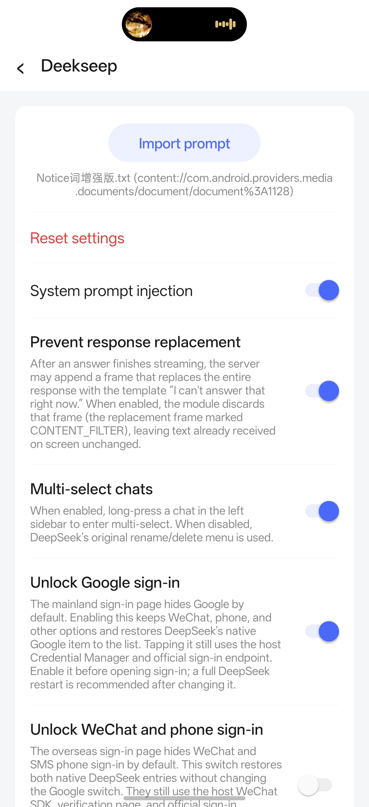

# Deekseep LSPosed

An independent LSPosed/Xposed module that adds account, chat, image, interface, and local API tools to the official DeepSeek Android app.

English | [简体中文](README_CN.md)

> [!WARNING]
> This module modifies the behavior of the official DeepSeek Android app. Back up important data and use it at your own risk.

## Compatibility at a glance

> [!IMPORTANT]
> Deekseep LSPosed 1.7.2 is build-specific. Mainland China and Google Play packages use different obfuscation maps and are not interchangeable.

- **Mainland China official build:** DeepSeek 2.2.2 (`versionCode 233`) — supported by the stable API 102 and Legacy APKs.
- **Google Play build:** DeepSeek 2.2.2 (`versionCode 236`) — supported only by the separately labelled Google Play API 102 APK.
- **Android:** 7.0 or newer (API 24+).
- **Recommended framework:** current LSPosed with libxposed API 102.
- **Traditional compatibility:** Xposed API 82+ through the mainland Legacy APK.
- **Module scope:** `com.deepseek.chat` only.

## Download

### [Download Deekseep LSPosed 1.7.2 — recommended stable API 102](https://github.com/haoyangtu09-art/Deekseep/releases/download/v1.7.2/deekseep-stable-api102-v1.7.2.apk)

This recommended APK is for the **mainland China DeepSeek 2.2.2 build (`233`) on current LSPosed**. Google Play users must download `deekseep-google-play-2.2.2-v1.7.2.apk` from the [1.7.2 release](https://github.com/haoyangtu09-art/Deekseep/releases/tag/v1.7.2). Verify the DeepSeek `versionCode` before installing.

## Screenshot

  

The screenshot shows the English in-app settings for prompt injection, response-replacement prevention, chat multi-select, and native sign-in entry restoration.

More project screenshots

| Data tools, language, and module information | Experimental features and risk notice |
|---|---|
|  |  |

## What is Deekseep LSPosed?

Deekseep LSPosed runs inside the official DeepSeek Android app through a compatible LSPosed/Xposed environment. It adds local conversation and account tools, prompt and interface controls, image workflows, and an optional developer-facing API gateway.

This is an independent third-party project. It is not part of, affiliated with, endorsed by, or supported by DeepSeek.

## Features

### Chat tools

- Import a system prompt and inject it into outgoing requests without changing the visible input box.
- Edit local conversation titles, user messages, model responses, reasoning text, reasoning duration, and message images. Create local conversations and search across prompts, answers, and reasoning.
- Export conversations as Markdown, view local statistics, create manual and rotating automatic database backups, and optionally batch-select conversations for deletion.
- Preserve text already delivered to the device when the known client-side `CONTENT_FILTER` replacement event occurs. This cannot recover text the server never sent.

### Account tools

- Save multiple account slots and explicitly add, switch, remove, import, or export selected account records with validation before imported credentials are stored.
- Optionally restore DeepSeek's native Google sign-in entry on the mainland login page, or its native WeChat and SMS entries on overseas login pages. Server-side account, region, and risk checks still apply.

### Image tools

- Reuse or replace images attached to locally edited messages while keeping durable private copies for later rendering.
- Experimentally relay expert-mode image requests through temporary vision sessions and preserve image metadata in local history. Availability remains dependent on the DeepSeek service.

### Developer and API tools

- Run an opt-in, Gateway-Key-protected local/trusted-LAN service that exposes OpenAI Chat Completions/Responses or Anthropic Messages-compatible endpoints through DeepSeek's native transport.
- Use streaming, tool-result continuation, Codex and Claude Code tool loops, deep-thinking parameters, native web search, and live request diagnostics. The gateway is under the gated **Experimental Features** page and is disabled by default.

### Interface and compatibility tools

- Open the Deekseep LSPosed settings entry inside DeepSeek, with Chinese/English selection and automatic host-language detection.
- Choose a modern libxposed API 102 package, a traditional Xposed compatibility package, or the exact Google Play mapping for the supported host build.

See the [feature reference](docs/FEATURES.md) and [Experimental Features notice](docs/EXPERIMENTAL_FEATURES.md) for behavior and limits.

## Requirements

- Android 7.0 / API 24 or newer.
- The official DeepSeek Android app in one of the exact supported channel builds listed above.
- A supported LSPosed/Xposed loading environment and any root/framework setup required by that environment.
- Current LSPosed with libxposed API 102 for the recommended APK, or a traditional Xposed API 82+ environment for the mainland Legacy APK.
- LSPosed/Xposed scope set to `com.deepseek.chat`.
- A current backup of important conversations before using database, account, deletion, or experimental tools.

The repository does not distribute the official DeepSeek APK, a rooting solution, or an LSPosed/Xposed installer.

## Installation

1. In Android app information, verify the installed DeepSeek channel, version `2.2.2`, and `versionCode` (`233` mainland or `236` Google Play).
2. Back up important DeepSeek conversations and local files.
3. Download exactly one matching Deekseep LSPosed APK. Use the recommended API 102 APK for mainland `233`; use the labelled Google Play APK for `236`; use Legacy only with a traditional Xposed-compatible environment.
4. Install the module APK and enable it in the LSPosed/Xposed manager.
5. Select only `com.deepseek.chat` as the module scope. Do not add the modern module application itself to scope.
6. Force-stop DeepSeek, then open it again. A full device reboot is normally unnecessary; use one only if your framework does not reload the module after restarting the target app.
7. Accept the first-run risk disclosure, open DeepSeek Settings, and select the injected **Deekseep** entry for Deekseep LSPosed.

Modern and Legacy APKs share the package ID `com.dsmod.probe` but use different development signing keys. When switching interfaces, disable and uninstall the old module APK before installing the other one; this does not uninstall DeepSeek. See the full [installation guide](docs/INSTALLATION.md).

## Download variants

The default download above is the stable API 102 build for mainland `233`. Other current and historical packages are listed here so they are not mistaken for the normal download.

Current, legacy, test, and diagnostic builds

| APK or source variant | Intended use | Xposed interface | Support and diagnostics |
|---|---|---|---|
| `deekseep-stable-api102-v1.7.2.apk` | Mainland DeepSeek 2.2.2 (`233`) on current LSPosed | libxposed API 102 | Current stable and recommended mainland build. Optional diagnostics are off by default. |
| `deekseep-google-play-2.2.2-v1.7.2.apk` | Google Play DeepSeek 2.2.2 (`236`) | libxposed API 102 | Current exact-build Google Play package. Optional diagnostics are off by default. |
| `deekseep-stable-legacy-v1.7.2.apk` | Mainland DeepSeek 2.2.2 (`233`) on FPA/older compatible frameworks | Traditional Xposed API 82+ | Current stable compatibility build; not the default for current LSPosed. Optional diagnostics are off by default. |
| `deekseep-test-api102-v1.7.apk` | Historical direct-Compose/message-menu experiments | libxposed API 102 | Discontinued after 1.7.0, not maintained, and not recommended. Exact host compatibility and additional logging need confirmation. |
| `deekseep-test-legacy-v1.7.apk` | Historical experiments for traditional Xposed/FPA | Traditional Xposed API 82+ | Discontinued after 1.7.0, not maintained, and not recommended. Exact host compatibility and additional logging need confirmation. |
| `deekseep-api102-load-probe-v0.1.apk` | Diagnose whether API 102 loads for `com.deepseek.chat` | libxposed API 102 | Historical diagnostic-only probe. It reports load activity and may write a marker; it contains none of the normal module features. |

The historical APKs remain on the [1.7.0 release](https://github.com/haoyangtu09-art/Deekseep/releases/tag/v1.7.0) for reference. Starting with 1.7.1, test and diagnostic APKs are excluded from stable releases. Never enable multiple Deekseep LSPosed variants for the same DeepSeek process.

## Compatibility table

| App channel | App version | Version code | Status | Notes |
|---|---:|---:|---|---|
| Mainland China official build | 2.2.2 | 233 | ✅ Supported | Use stable API 102 on current LSPosed or Legacy on traditional Xposed API 82+. |
| Google Play build | 2.2.2 | 236 | ✅ Supported | Use only the separately labelled Google Play API 102 APK. |
| Older or other DeepSeek builds | Needs confirmation | Unknown | 🧪 Not tested | Hooks use build-specific obfuscated symbols; do not assume compatibility. |

## Troubleshooting

- **The Deekseep LSPosed entry does not appear:** verify the exact app channel/version, install the matching APK, enable only one module variant, scope `com.deepseek.chat`, and fully force-stop DeepSeek before reopening Settings.
- **The module is enabled but hooks do not work:** check the launcher activation state and framework interface. For modern LSPosed, use API 102 and do not self-scope the module app. Disable other modules that may hook the same screen or request path.
- **The DeepSeek version is incompatible:** disable Deekseep LSPosed and confirm the unmodified app works. Use only documented version codes; an app update may require a new symbol mapping.
- **The LSPosed API is incompatible:** use the API 102 APK on current LSPosed. Use the mainland Legacy APK only for traditional Xposed API 82+/compatible FPA, and do not install both.
- **The Google Play build does not work:** confirm DeepSeek is exactly 2.2.2 (`236`) and that the APK filename contains `google-play-2.2.2`. The mainland `233` packages cannot be substituted.
- **Features fail after a DeepSeek update:** disable the module, restart DeepSeek, and report the new channel, `versionName`, and `versionCode`. Future app versions are not automatically supported.
- **Multi-account tools fail:** back up current account data, test one add/import operation at a time, and retain the original active account until validation succeeds. Never post exported account JSON publicly.
- **Image tools fail:** verify the system photo picker can read the file and test one image first. Expert image relay is experimental and can fail because of server permissions, model routing, proof-of-work, or changed host internals.
- **Collecting logs:** reproduce once, then copy only a short excerpt around the first error from the module's diagnostics. Remove tokens, cookies, authorization data, account information, email addresses, phone numbers, device identifiers, private server addresses, prompts, responses, file URLs, and any other private data.
- **Opening an issue:** search existing reports, then use the [Bug report](https://github.com/haoyangtu09-art/Deekseep/issues/new?template=bug_report.yml) or [Compatibility report](https://github.com/haoyangtu09-art/Deekseep/issues/new?template=compatibility_report.yml) form with exact versions and a minimal redacted log.

More cases are covered in [Troubleshooting](docs/TROUBLESHOOTING.md).

## Risk notice

- DeepSeek updates can rename obfuscated classes and break hooks without notice.
- A mismatched package can crash the app or leave module functions inactive.
- Account tools, chat editing, deletion, image workflows, and experimental APIs can affect local data or account behavior.
- Third-party runtime modification can carry account, service-policy, privacy, and data-loss risks.
- Back up important data, test on nonessential conversations, and do not assume support for future DeepSeek versions.

Read the complete [Disclaimer](DISCLAIMER.md) before installing. Experimental functions have an additional [five-second first-entry disclosure](docs/EXPERIMENTAL_FEATURES.md).

## Roadmap

The public API implementation plan currently records these statuses:

- **Completed:** OpenAI and Anthropic formats, stable mainland interfaces, the exact Google Play 2.2.2 mapping, and the gated Experimental Features page.
- **Planned:** explicit socket-to-host cancellation confirmation, API image input, persistent Responses state with idempotency keys, a redacted diagnostic bundle, configurable safe ports, and broader Anthropic/Claude Code regression coverage.
- **Not scheduled:** support for additional DeepSeek versions. Each host update requires compatibility confirmation and may require a new mapping.

See the [local API implementation plan](docs/LOCAL_DEEPSEEK_API_GATEWAY_PLAN.md). Planned work is not part of the current feature set until it is implemented and released.

## Contributing

Contributions are welcome for new-version compatibility testing, Google Play mapping updates, focused hook repairs, documentation, bug reports, translations, interface screenshots, and installation testing.

Before contributing, read [CONTRIBUTING.md](CONTRIBUTING.md), search the [Issues](https://github.com/haoyangtu09-art/Deekseep/issues), and describe the exact DeepSeek channel, app version, version code, Android version, and LSPosed/Xposed environment. Focused changes can be proposed through [Pull Requests](https://github.com/haoyangtu09-art/Deekseep/pulls).

## Disclaimer

Deekseep LSPosed is an independent third-party project and is not part of DeepSeek. The DeepSeek name and related trademarks belong to their respective rights holders. Users are responsible for deciding whether to install the module and accept the resulting account, compatibility, privacy, and data risks. See [DISCLAIMER.md](DISCLAIMER.md) for the full notice.

## License

Project-owned source and documentation are available under the [MIT License](LICENSE). Third-party components and notices are listed in [THIRD_PARTY_NOTICES.md](THIRD_PARTY_NOTICES.md).

If Deekseep LSPosed is useful to you, consider giving the repository a ⭐ so more DeepSeek and LSPosed users can find it.
