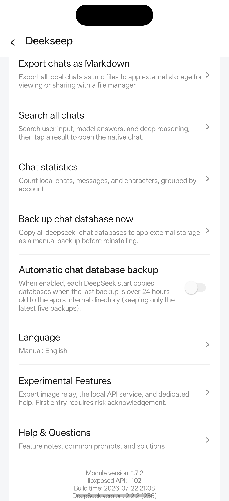
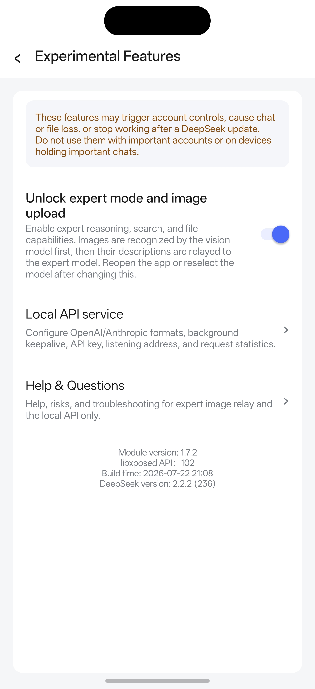

# Deekseep LSPosed

一个面向官方 DeepSeek Android App 的独立 LSPosed/Xposed 模块，提供账号、聊天、图片、界面和本地 API 增强工具。

[English](README.md) | 简体中文

> [!WARNING]
> 本模块会修改官方 DeepSeek Android App 的运行行为。请先备份重要数据，并自行承担使用风险。

## 兼容情况速览

> [!IMPORTANT]
> Deekseep LSPosed 1.7.2 按具体 App 构建适配。中国大陆版与 Google Play 版使用不同的混淆符号映射，安装包不能混用。

- 中国大陆官方版：DeepSeek 2.2.2（`versionCode 233`），支持稳定 API 102 版和 Legacy 版。
- Google Play 版：DeepSeek 2.2.2（`versionCode 236`），只支持单独标注的 Google Play API 102 安装包。
- Android：7.0 及以上（API 24+）。
- 推荐框架：支持 libxposed API 102 的当前版 LSPosed。
- 传统接口兼容：中国大陆版可使用传统 Xposed API 82+ 的 Legacy 安装包。
- 模块作用域：只勾选 `com.deepseek.chat`。

## 推荐下载

### [下载 Deekseep LSPosed 1.7.2——推荐稳定 API 102 版](https://github.com/haoyangtu09-art/Deekseep/releases/download/v1.7.2/deekseep-stable-api102-v1.7.2.apk)

这个默认推荐包适用于中国大陆版 DeepSeek 2.2.2（`233`）和当前版 LSPosed。Google Play 用户必须前往 [1.7.2 Release](https://github.com/haoyangtu09-art/Deekseep/releases/tag/v1.7.2) 下载 `deekseep-google-play-2.2.2-v1.7.2.apk`。安装前务必核对 DeepSeek 的 `versionCode`。

## 项目截图

  

截图展示了英文版模块设置中的提示词注入、响应替换保护、聊天多选和原生登录入口恢复开关。

查看更多项目截图

| 数据工具、语言与模块信息 | 实验性功能及风险提示 |
|---|---|
|  |  |

## 项目介绍

Deekseep LSPosed 通过兼容的 LSPosed/Xposed 环境运行在官方 DeepSeek Android App 进程中，为本地会话、账号、提示词、界面、图片流程和开发者 API 增加可选工具。

本项目是独立第三方项目，不属于 DeepSeek 官方，也未获得 DeepSeek 的隶属、认可或支持。

## 功能介绍

### 聊天工具

- 导入系统提示词，并在不改动可见输入框的情况下写入发送请求。
- 编辑本地会话标题、用户消息、模型回复、思考内容、思考时间和消息图片；支持新建本地会话，并搜索问题、回复和思考文本。
- 将聊天导出为 Markdown，查看本地统计，手动或按保留数量自动备份数据库，并可选启用聊天批量选择与删除。
- 在已知的客户端 `CONTENT_FILTER` 替换事件发生时保留设备已经收到的文本；无法恢复服务器从未下发的内容。

### 账号工具

- 保存多个账号槽位，明确执行添加、切换、删除、选择性导入或导出，并在保存导入凭证前进行校验。
- 可选恢复中国大陆登录页中的 DeepSeek 原生 Google 登录入口，或恢复海外登录页中的原生微信和短信入口；账号、地区和风控结果仍由服务器决定。

### 图片工具

- 在编辑本地消息时复用或替换图片，并保存用于后续显示的私有持久副本。
- 实验性地通过临时视觉会话处理中继专家模式图片请求，并在本地历史中保存图片元数据；是否可用仍取决于 DeepSeek 服务端。

### 开发者与 API 工具

- 可选启动带独立 Gateway Key 的本机/可信局域网服务，通过 DeepSeek 原生传输提供 OpenAI Chat Completions/Responses 或 Anthropic Messages 兼容接口。
- 支持流式输出、工具结果续写、Codex 和 Claude Code 工具循环、深度思考参数、原生联网搜索与实时请求诊断。本地 API 位于带风险门槛的“实验性功能”页中，默认关闭。

### 界面与兼容增强

- 在 DeepSeek 设置中显示 Deekseep LSPosed 入口，支持中英文自动检测和手动选择。
- 根据环境选择现代 libxposed API 102、传统 Xposed 兼容版或针对 Google Play 的精确映射版。

详细行为与限制见[功能说明](docs/FEATURES.md)和[实验性功能说明](docs/EXPERIMENTAL_FEATURES.md)。

## 环境要求

- Android 7.0 / API 24 或更高版本。
- 安装上方兼容列表中精确匹配渠道和版本的官方 DeepSeek Android App。
- 能加载模块的 LSPosed/Xposed 环境，以及该环境本身所要求的 Root 或框架配置。
- 默认推荐包需要支持 libxposed API 102 的当前 LSPosed；中国大陆 Legacy 包需要传统 Xposed API 82+ 环境。
- LSPosed/Xposed 作用域设置为 `com.deepseek.chat`。
- 使用数据库、账号、删除或实验性工具前，先备份重要聊天记录。

本仓库不提供官方 DeepSeek APK、Root 方案或 LSPosed/Xposed 安装器。

## 安装步骤

1. 在 Android 应用信息中确认 DeepSeek 的渠道、版本 `2.2.2` 和 `versionCode`（中国大陆版为 `233`，Google Play 版为 `236`）。
2. 备份重要的 DeepSeek 聊天记录和本地文件。
3. 只下载一个与环境匹配的 Deekseep LSPosed APK：中国大陆 `233` + 当前 LSPosed 使用默认推荐 API 102 包；Google Play `236` 使用专用包；只有传统 Xposed 兼容环境才使用 Legacy 包。
4. 安装模块 APK，并在 LSPosed/Xposed 管理器中启用。
5. 作用域只勾选 `com.deepseek.chat`；现代版不需要勾选模块自身应用。
6. 强制停止 DeepSeek 后重新打开。通常不需要重启整台设备；只有框架在目标 App 重启后仍未重新加载模块时再重启设备。
7. 阅读并确认首次风险提示，然后进入 DeepSeek 设置，打开 Deekseep LSPosed 注入的 Deekseep 入口。

现代版和 Legacy 版共用包名 `com.dsmod.probe`，但开发签名不同。切换接口时应先停用并卸载旧模块 APK，再安装另一个版本；这不会卸载 DeepSeek。更多细节见[安装指南](docs/INSTALLATION.md)。

## 安装包类型

首页默认只推荐中国大陆 `233` 的稳定 API 102 版。其他当前或历史包折叠在下方，避免普通用户误装。

当前、Legacy、测试与诊断安装包

| APK 或源码类型 | 适用场景 | Xposed 接口 | 支持状态与日志 |
|---|---|---|---|
| `deekseep-stable-api102-v1.7.2.apk` | 中国大陆 DeepSeek 2.2.2（`233`）+ 当前 LSPosed | libxposed API 102 | 当前稳定版，也是中国大陆普通用户的推荐包；可选诊断默认关闭。 |
| `deekseep-google-play-2.2.2-v1.7.2.apk` | Google Play DeepSeek 2.2.2（`236`） | libxposed API 102 | 当前按精确 App 构建适配的 Google Play 包；可选诊断默认关闭。 |
| `deekseep-stable-legacy-v1.7.2.apk` | 中国大陆 DeepSeek 2.2.2（`233`）+ FPA/较旧兼容框架 | 传统 Xposed API 82+ | 当前稳定兼容版；当前 LSPosed 普通用户不应默认选择；可选诊断默认关闭。 |
| `deekseep-test-api102-v1.7.apk` | 历史 Compose/消息菜单实验 | libxposed API 102 | 1.7.0 后已停止维护和发布，不推荐使用；精确宿主兼容性及额外日志情况待确认。 |
| `deekseep-test-legacy-v1.7.apk` | 面向传统 Xposed/FPA 的历史实验 | 传统 Xposed API 82+ | 1.7.0 后已停止维护和发布，不推荐使用；精确宿主兼容性及额外日志情况待确认。 |
| `deekseep-api102-load-probe-v0.1.apk` | 检查 API 102 是否能为 `com.deepseek.chat` 加载 | libxposed API 102 | 历史诊断探针，只报告加载并可能写入标记，不包含正常模块功能。 |

这些历史包仍保留在 [1.7.0 Release](https://github.com/haoyangtu09-art/Deekseep/releases/tag/v1.7.0) 供核对。自 1.7.1 起，稳定 Release 不再包含测试版和诊断版。不要为同一个 DeepSeek 进程同时启用多个 Deekseep LSPosed 版本。

## 兼容性表格

| App 渠道 | App 版本 | versionCode | 状态 | 说明 |
|---|---:|---:|---|---|
| 中国大陆官方版 | 2.2.2 | 233 | ✅ 支持 | 当前 LSPosed 使用稳定 API 102；传统 Xposed API 82+ 使用 Legacy。 |
| Google Play 版 | 2.2.2 | 236 | ✅ 支持 | 只能使用单独标注的 Google Play API 102 APK。 |
| 更旧或其他 DeepSeek 构建 | 待确认 | Unknown | 🧪 未测试 | Hook 依赖具体构建的混淆符号，不能假定兼容。 |

## 常见问题

- Deekseep LSPosed 入口不显示：核对 App 渠道与版本，安装对应 APK，只启用一个模块版本，作用域勾选 `com.deepseek.chat`，强制停止 DeepSeek 后重新进入设置首页。
- 模块已启用但 Hook 不生效：检查模块启动页的激活状态和框架接口。现代 LSPosed 使用 API 102，不要把模块自身加入作用域；同时停用可能修改同一界面或请求路径的其他模块。
- DeepSeek 版本不兼容：先停用 Deekseep LSPosed，确认原 App 能正常运行。只使用文档明确支持的 versionCode；App 更新后可能需要重新映射。
- LSPosed API 不兼容：当前 LSPosed 使用 API 102 包；中国大陆 Legacy 包只面向传统 Xposed API 82+/兼容 FPA，不能两个一起装。
- Google Play 版无法使用：确认 DeepSeek 恰好是 2.2.2（`236`），且模块文件名包含 `google-play-2.2.2`；不能用中国大陆 `233` 的 APK 替代。
- DeepSeek 更新后功能失效：停用模块并重启 DeepSeek，然后报告新的渠道、`versionName` 和 `versionCode`。本项目不自动保证未来版本兼容。
- 多账号功能异常：先备份当前账号数据，每次只测试一次添加或导入，并在验证成功前保留原活动账号。不要公开上传导出的账号 JSON。
- 图片功能异常：确认系统图片选择器能读取文件，并先测试单张图片。专家图片中继属于实验功能，可能受服务器权限、模型路由、PoW 或宿主内部变化影响。
- 收集日志：只复现一次，截取模块诊断中首次错误附近的少量行。必须删除 Token、Cookie、Authorization、账号信息、邮箱、手机号、设备标识、私有服务器地址、提示词、回复、文件链接和其他隐私信息。
- 提交 Issue：先搜索已有问题，再通过 [Bug 报告](https://github.com/haoyangtu09-art/Deekseep/issues/new?template=bug_report.yml)或[兼容性报告](https://github.com/haoyangtu09-art/Deekseep/issues/new?template=compatibility_report.yml)填写精确版本与最小脱敏日志。

更多排查方法见[故障排查文档](docs/TROUBLESHOOTING.md)。

## 风险说明

- DeepSeek 更新可能更改混淆类名，使 Hook 随时失效。
- 安装与渠道或 versionCode 不匹配的模块可能导致 App 崩溃或功能无效。
- 账号工具、聊天编辑、删除、图片处理和实验性 API 可能影响本地数据或账号行为。
- 使用第三方运行时模块可能带来账号、服务条款、隐私和数据丢失风险。
- 请先备份重要数据，只在非重要聊天中测试，不要假定未来 DeepSeek 版本会继续兼容。

安装前请阅读完整的[免责声明](DISCLAIMER.md)。实验性功能还会显示独立的[五秒首次进入风险提示](docs/EXPERIMENTAL_FEATURES.md)。

## 开发计划

仓库中的本地 API 实现计划目前记录了以下状态：

- 已完成：OpenAI 与 Anthropic 双格式、国内版两个稳定接口、Google Play 2.2.2 精确映射，以及带门槛的实验性功能页。
- 计划中：socket 到宿主 Flow 的明确取消确认、API 图片输入、Responses 状态持久化和幂等键、脱敏诊断包、安全端口配置，以及更广的 Anthropic/Claude Code 回归测试。
- 未排期：其他 DeepSeek 版本适配。每次 App 更新都需要重新确认兼容性，并可能需要新的符号映射。

详情见[本地 API 实现状态与计划](docs/LOCAL_DEEPSEEK_API_GATEWAY_PLAN.md)。计划项在真正实现并发布前不属于当前功能。

## 贡献说明

欢迎贡献新版本兼容测试、Google Play 映射、聚焦的 Hook 修复、文档改进、Bug 报告、翻译、界面截图和安装测试。

参与前请阅读 [CONTRIBUTING.md](CONTRIBUTING.md)，搜索现有 [Issues](https://github.com/haoyangtu09-art/Deekseep/issues)，并写明 DeepSeek 渠道、App 版本、versionCode、Android 版本及 LSPosed/Xposed 环境。聚焦的修改可以通过 [Pull Requests](https://github.com/haoyangtu09-art/Deekseep/pulls)提交。

## 免责声明

Deekseep LSPosed 是独立第三方项目，不属于 DeepSeek 官方。DeepSeek 名称及相关商标归其合法权利人所有。是否安装模块以及由此产生的账号、兼容性、隐私和数据风险由用户自行判断和承担。完整内容见 [DISCLAIMER.md](DISCLAIMER.md)。

## 许可证

项目自有源码和文档采用 [MIT License](LICENSE)。第三方组件及声明见 [THIRD_PARTY_NOTICES.md](THIRD_PARTY_NOTICES.md)。

如果 Deekseep LSPosed 对你有帮助，可以给仓库点一个 ⭐，让更多 DeepSeek 和 LSPosed 用户发现它。
